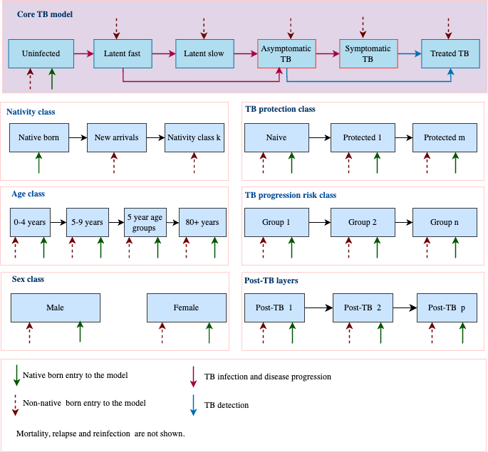

```{r, include = FALSE}
knitr::opts_chunk$set(
  collapse = TRUE,
  comment = "#>",
  tidy.opts = list(width.cutoff = 60), tidy = TRUE
)
```


# Purpose

This R package supplies a tuberculosis (TB) transmission model that represents UK population dynamics and is intended to be flexible in what structural aspects it represents for particular problems. The aim is to provide an analytical tool to evaluate the economic and epidemiological impact of policy options. 

# Structure

The overall strcture is represented in Figure 1. The TB layers follow a fairly standard pattern:

- Uninfected: those with not evidence of TB infection
- Latent fast: those with evidence of recent TB infection at higher risk of progression to TB disease
- Latent slow: those with evidence of older TB infection at lower risk of progression to TB disease
- Asymptomatic TB disease: those with TB disease who are not aware of symptoms
- Symptomatic TB disease: those with TB disease who are aware of symptoms
- TB treatment: those receiving anti-TB treatment



## Layers

Other aspects of structure are represented as layers, most of which have have numbers which can be specified by users. Technically, layers represent index values in multidimensional arrays. 
The following 7 aspects of structure are represented as layers:

- Age (fixed): there are 17 5-year age groups, 0-4 years up to 80+ years 
- Sex (fixed): there are two genders (male, female)
- Natal class (variable): this is to represent population sectors arriving from higher TB risk countries
- Risk group (variable): this is to population sectors with social risk factors, or HIV/ART etc. 
- Post-TB (variable): this is to represent people who have previously had TB
- Strain (variable): this is for explicit representation of drug-resistant strains
- Protection (variable): this is to represent interventions like preventive therapy

# Installation and use

The model is maintained on GitHub at: [https://github.com/petedodd/OCA1](https://github.com/petedodd/OCA1). 


## Installation

Installing the package requires R to be setup to compile C code. If the R package `devtools` has been installed, `OCA1` can be installed by running:


```{r, eval=FALSE}
devtools::install_github("petedodd/OCA1")
```

If the argument `build_vignettes=TRUE` is added to the above, and you have a working LaTeX installation, this document will be generated and can be found via 

```{r,eval=FALSE}
browseVignettes(package = "OCA1")
```
If it is not possible to compile C code on your system, you may ask a user of the same operating system to generate you a binary version of the package.

## Creating model parameters

Having installed the package, it can be loaded in the usual way and the `known_parameters()` function gives a read out with the parameters available for specification associated with each element of the structure:
```{r setup}
library(OCA1) #load the package

##what parameters are available [with what dimensions]
known_parameters()
```
In addition many of the functions have their own R man pages guiding use, although some are still in draft.

We have tried to minimize the load required by a user to specify parameters through a system of defaults:
```{r}
## example without nativity class used
pms <- create_parms(verbose=TRUE) #create UK parameters
```
By default, there is only one layer for each of the variable structure elements. The more layers there are, the more ordinary differential equations (ODEs) the model uses, and therefore the slower it is.

Going beyond defaults means specifying the number of layers for each aspect of structure, and providing parameter data associated with this structure within a separate list. The input lists are:

- `migrationdata`: parameters to define migration dynamics
- `riskdata`: parameters to define risk structure and dynamics 
- `postdata`: parameters to define post-TB structure and dynamics
- `straindata`: parameters to define aspects of strain structure
- `protdata`: paraneters to define protection structure and dynamics
- `tbparms`: these are TB-specific parameters, not necessarily associated with layer dimensions

where lists, or items within lists, are not provided, appropriate dimension defaul values will be provided.


For example, to speciy 2 natal classes with 90% of people initially in the native-born layer, one would use:
```{r}
# version with 2 static nativity classes
pms <- create_parms(nnat = 2, migrationdata = list(propinitnat = c(0.9,0.1)))
```


To have two layers in the natal class and risk dimensions, one would use:
```{r}
## version with 2 static nativity classes and 2 static risk classes
pms <- create_parms(nnat = 2, nrisk = 2,
                    migrationdata = list(propinitnat = c(0.9,0.1)),
                    riskdata = list(propinitrisk = c(0.9,0.1)))
```

If `verbose=TRUE`, the number of strata is stated. Having 2 layers in every dimension means having thousands of ODEs. 
```{r}
## go big version with all strata to some degree:
pms <- create_parms(
  nnat = 2, nrisk = 2, npost = 2, nstrain = 2, nprot = 2,
  migrationdata = list(propinitnat = c(0.9,0.1)),
  riskdata = list(propinitrisk = c(0.9,0.1)),
  straindata = list(propinitstrain = c(0.9,0.1)),
  protdata = list(propinitprot = c(0.9,0.1)))
```
It is not really intended that all layers should be used at once, and doing so may easily result in a model that is not possible to run, or not possible to run fast enough to be practically useful.

The years run over are set via the `tc` argument to `create_parms` which is `tc=1970:2020` by default. Some input parameters (e.g. migration rates, case detection rates) are arrays with a time dimension to capture their dynamics. These variables are automatically linearly interpolated within the model based on input data. 

As far as possible, we have tried to design checks for parameters provided to ensure that they make sense for the intended model structure.

## Running the model

For a given set of parameters, `runmodel` will run the model. By default, the output will be split into a list of `data.table` objects which represent model output in 'long' format

```{r}
## example without nativity class used
pms <- create_parms(tbparms=list(staticfoi=1, foi=1e-2)) #create UK parameters

out <- runmodel(pms,verbose=TRUE)              #run model with these
out                               #inspect
```
With `verbose=TRUE` the model returns information including metrics of fit to the overall growth of the total population.


## Visualizing model output

We have provided a few plotting utilities for inspecting model output.

In the case of demography, these compare model output (lines) against UK data (points) for total population :
```{r}
## visualize
plt_DemoGrowth(out)               #total population over time
```

and also for age/sex strata:
```{r,fig.dim = c(8, 6)}
plt_DemoSnapshots(out)            #snapshots
```

There are analogous plotters for some TB aspects, which can specify splits by certain layers:
```{r}
plt_TBSnapshots(out, by_layer = "natcat")
```

Similarly for the different rates outputted by the model:
```{r}

plt_TBRates(out,rate_type = "incidence",by_layer = "natcat")
```

# Example use

The following cases provide toy examples of particular use cases.

WIP


## Example of implementing in-migration and out-migration 

First let's generate dummy migration data. Assuming that both in-migration and out-migration follow a polynomial distribution as  function of year :

$$
Y(t) = \beta_0 + \beta_1 t + \beta_2 t^2 
$$

Plugging the following  $\beta$ coefficients into the above equation, we can generate in-migration and outmigration dummy data as in below: 


```{r}
## create dummy parameters with 2 natal classes:
pms <- create_parms(nnat = 2, 
                    migrationdata = list(propinitnat = c(0.9,0.1)))

## dummy data:
Year   <-1970:2020
## in-migration numbers from countries of interest
inmigr <- (5.114998e+05 - 5.238264e+02*Year +  1.341414e-01*Year^2)/10
## out-migration hazard for countries of interest
emigr  <- (3.127034e+05 - 3.170702e+02*Year +  8.043165e-02*Year^2)/1e6

plot(Year,inmigr,type="l") #look

## age/sex patterns (use same pattern in/out)
prop_males <- c(rep(c(1,2,3.5,5.5,5,3,2,1), each=2),1)/100
prop_females <-c(rep(c(1,2,4,6,5,3.5,2.5,1.5), each=2),2)/100

## create toy data
imig <- array(0, dim= dim(pms[["immigration"]]), 
              dimnames =dimnames(pms[["immigration"]]))
emig <- array(0, dim= dim(pms[["exmigrate"]]), 
               dimnames =dimnames(pms[["exmigrate"]]))
imig[, , 1] <- inmigr * prop_males  
imig[, , 2] <- inmigr * prop_females  
emig[, , 1, 2] <- emigr * prop_males  # Males
emig[, , 2, 2] <- emigr * prop_females  # Females

```

We can now call the parameter generating function and update the migration inputs as below:

```{r}
pms <- create_parms(nnat = 2, 
                    migrationdata = 
                    list(propinitnat = c(0.9,0.1),
                    immigration = imig,
                    exmigrate = emig))

out <- runmodel(pms,verbose=TRUE) 

```
The model fit to overall demographic growth remains good (see fit statistics). 
Further refinement would be needed to specify the prevalence of TB infection and disease among in-migrants.
Interventions would then be specified via time-dependent rates for the relevant parameters.
More complex natal structures are possible, e.g. `nnat=3` with ageing through from 'recent' arrivals to 'established', with corresponding waning in the relative risk of progression to TB disease.


# Mathematical specification

We use the index notation: $a$ is age, $s$ is sex, $n$ is natal class, $r$ is risk group, $p$ is protection, and $q$ is strain. For simplicity however, we suppress the indices $a,s,n,r,p,q$ wherever possible in the following. Similarly, many states and rates depend on time ($t$), but we do not make this dependence explicit except where seeking to emphasize it.

We use the following notation for TB states:

- Uninfected: $U$
- Latent fast: $E$
- Latent slow: $L$
- Asymptomatic TB disease: $A$
- Symptomatic TB disease: $D$
- TB treatment: $T$

The ODEs in shorthand notation are then


$$
\begin{aligned}
& \frac{\mathrm{d}}{\mathrm{d}t}U(t) = \Delta U - \lambda U\\
& \frac{\mathrm{d}}{\mathrm{d}t}E(t) =  \Delta E + \lambda U - (s+p)E + \lambda v L\\
& \frac{\mathrm{d}}{\mathrm{d}t}L(t) =  \Delta L + s E - \epsilon L + TL - \mathbb{1}(p=2)\rho L_p - \lambda v L + (1-\psi)D/\tau\\
& \frac{\mathrm{d}}{\mathrm{d}t}A(t) =  \Delta A + pE + \epsilon L - fA - \delta^A A + TA + \mathbb{1}(p=2)\rho L_p\\
& \frac{\mathrm{d}}{\mathrm{d}t}D(t) =  \Delta D + fA - \omega D\\
& \frac{\mathrm{d}}{\mathrm{d}t}T(t) =  \Delta T + TS - T/d
\end{aligned}
$$
We use $\mathbb{1}(Y)$ to be an indicator function returning 1 if and only if the statement arguments are all true, and zero otherwise.

Here, the parameters have the following meanings:

- $s$: stabilization rate
- $p$: fast progression rate
- $v$: partial protection from TB infection
- $\rho$: relapse rate
- $\psi$: CFR for untreated TB
- $\tau$: natural duration for untreated TB
- $f$: symptom progression rate
- $\delta^A$: asymptomatic TB detection rate
- $\omega$: symtompatic TB detection + self-cure + mortality rate
- $d$: durations of TB treatment
- $TS$: treatment starts (TODO see below) 
- $TL$: flow to latent from treatment completion (TODO see below)
- $TA$: flow to asymptomatic from treatment completion (TODO see below)


The non-TB dynamical terms $\Delta X$ (where $X$ represents a TB state) follow the pattern:
$$
\begin{aligned}
& \Delta X = \overbrace{r_{a-1} X_{a-1} - r_{a} X_{a}}^{\mathrm{ageing}} + \overbrace{\mathbb{1}(a=1,X=U,n=1)b_{s,p,q}}^{\mathrm{births}} + \overbrace{\mathbb{1}(n=2)\iota^X_{a,s}\iota_{s,r,p,q}I_{a,s}}^{\mathrm{in-migration}} - \overbrace{\Omega_{a,s,n} X_{a,s,n}}^{\mathrm{out-migration}} - \overbrace{\bar{\mu}_{a,s}X_{a,s}}^{\mathrm{rest}} \\
& + \underbrace{m_{n-1}X_{n-1}-m_n X_n}_{\mathrm{natal~ageing}} + \underbrace{h_{a,s,r-1}(t)X_{a,s,r-1} - h_{a,s,r}(t)X_{a,s,r}}_{\mathrm{risk~progression}} + \underbrace{\pi_{p-1} X_{p-1} - \pi_p X_{p}}_{\mathrm{PostTB-ageing}}
\end{aligned}
$$

The force-of-infection, $\lambda$, if not running in static mode, 
$$
\lambda_{asnrqp}(t) = \sum_{a's'n'r'q'p'}\beta_{asnrqp;a's'n'r'q'p'}\left(\frac{\alpha A_{a's'n'r'q'p'}+D_{a's'n'r'q'p'}}{N}\right) 
$$
This parametrization is used so that random mixing matrices are more easily specified without knowing relative subpopulation sizes.

Mixing is assumed to depend on age, sex, natal class, risk group and strain, with the effective contact rate modelled as a tensor product:

$$
\beta = \beta^{\mathrm{age}}\otimes\beta^{\mathrm{sex}}\otimes\beta^{\mathrm{natal}}\otimes\beta^{\mathrm{risk}}\otimes\beta^{\mathrm{strain}}
$$


The table below (TODO) relates this notation of this section to the naming conventions used in the model.


